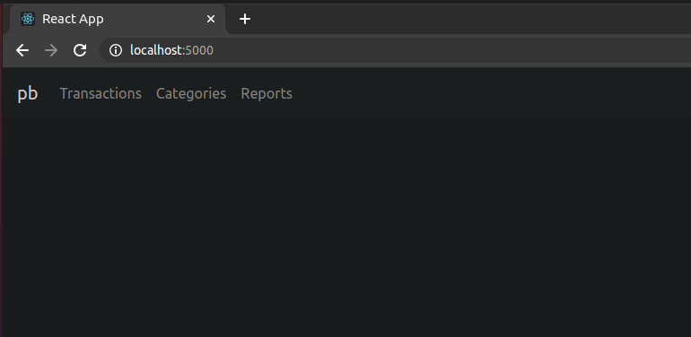
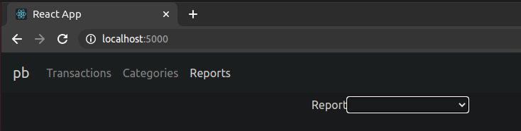

# Personal Budget

## Use

### Initial Set Up
1. Create a directory/folder on your computer that will hold all your personal financial transactions.

### Starting the app
1. Copy the absolute file path of the directory/folder you created in the step above.
   - NOTE:  On Windows this will be something like `C://the/absolute/path`.  On Mac or Linux this will be something like 
     `/the/absolute/path`.
2. If you have docker installed on your computer already, then run `docker pull personal-budget:latest` to pull the docker 
   image containing both the backend and UI codebase.  
   - NOTE:  If docker is not installed, then install docker.  Once it's installed, continue this step.
3. Start a docker container using the image by running `docker run -v <path from step #2 goes here>:/personal-budget/data --publish 5000:5000 joneschris/personal-budget:latest` 
   and substitute the absolute file path from step #2 where the `<path from step #2 goes here>` placeholder is.
4. Open a browser and go to `http://localhost:5000`.  You should see the following:
   

### Using the app
##### Overview
- You can view your transactions by clicking on the `Transactions` tab.  
- Transactions can be assigned 1 or more categories.  You can add categories by clicking on the `Categories` tab.
- You can generate reports by going to the Reports tab.

##### Configuration
After performing the steps in the `Starting the app` section above, you'll notice that the directory/folder you created in
step #1 has been populated with some directories/folders and files.  Specifically:

1. A `config.json` file that contains application configuration.
2. A SQLite database named `budget`.  This will hold all of your personal financial data that you choose to import.
3. `/transactions` directory to hold CSV files containing transactions to import into the `budget` database.
4. `/reports` directory to hold `.xlsx` spreadsheets that you can use to visualize or report on your personal financial data.

The most import file is the `config.json`.  This file contains 2 sections:  `reports` and `imports`.  

##### Reports
The `reports` section is where you add `.xlsx` reports that you have created and placed in the `/reports` directory 
in #4 above.  There are 3 properties that make up a report JSON object:

```json
{
   "name": "My Spreadsheet.xlsx",
   "import_transactions": true,
   "import_categories": true
}
```

The `name` field is the name of the spreadsheet and must match the name of the spreadsheet in the `/reports` directory. 
The `import_transactions` field should be set to `true` if you want transactions to be imported into the spreadsheet when 
it is generated.  If not, you should set it to be `false`.  The `import_categories` field should be set to `true` if you want categories
to be imported into the spreadsheet when it is generated.  If not, you should set it to be `false`.

The application will load each of the report JSON objects when the application starts and display them in the `Report` 
dropdown box in the UI's Reports tab.  



When you run a report in the UI above, you must choose a report as well as a start and end date.  The start and end date 
will be used to import transactions into the report.  

If you do want to import transactions, the report will need to contain a worksheet named `Transactions`.  Similarly,
if you want to import categories, the report will need to contain a worksheet named `Categories`.  Please see the sample
report that was generated in `/reports`in the directory you created.

##### Imports
There are 2 fields under the `imports` section of the `config.json`: `csv` and `ofx`.  

###### CSV
The `csv` field contains JSON objects that look like this:

```json
{
  "data_type": "TRANSACTION",
  "directory": "myBank",
  "headers": [
    "posted",
    "blank1",
    "date",
    "blank2",
    "description",
    "category",
    "amount"
  ],
  "mappings": {
    "payee": [
      "description"
    ],
    "date": [
      "date"
    ],
    "amount": [
      "amount"
    ]
  }
}
```

The field definitions are:

1. `data_type`: The data type of the CSV file.  Valid values are `TRANSACTION`.
2. `directory`: The directory inside the `/transactions` directory that will hold the CSV files.  The value should be the
   name of the financial institution the files were downloaded from (ex:  `usaa`, `first_community_bank`, etc).
3. `headers`: An array of strings specifying the header names of each of the columns in the CSV file.
4. `mappings`: A JSON object specifying how to map the `headers` to a database transaction record's `payee`, `date` and `amount`.

###### OFX
OFX (Open Financial Exchange) is a data format for exchanging financial information.  It has been in use for decades and 
hundreds of banks host web services where their membership can query their financial information.  You can read more about
OFX at http://ofxhome.com/.  You can find information about your financial institution's OFX service at http://www.ofxhome.com/index.php/home/directory.

The `config.json` contains an `ofx` array of JSON objects with each JSON object looking like:

```json
{
     "member_id": "abc123",
     "password": "def456",
     "institution_id": "12345",
     "url": "https://my.bank.com/ofx/OFXServlet",
     "organization_name": "MyBank",
     "data_type": "TRANSACTION"
   }
```

The field definitions are:

1. `member_id`: Your username or member id number.  You may need to contact your financial institution to understand what your
   `member_id` is.
2. `password`: Your password.  You may need to contact your financial institution to understand what your OFX `password` is.  
   In some cases, it is the PIN and not the password to log on to the financial instituion's website.
3. `insitituion_id`: This is the you institution's ID as found on ofxhome.com.  For example, USAA's FI Id and, therefore, 
   `institution_id` is 24591 per http://www.ofxhome.com/index.php/institution/view/483.
4. `url`: The URL of the financial institution's OFX web service.  This can be found on ofxhome.com.  For example, USAA's 
   URL is https://service2.usaa.com/ofx/OFXServlet per http://www.ofxhome.com/index.php/institution/view/483.
5. `organization_name`: The name of the financial institution.
6. `data_type`: The data type of the CSV file.  Valid values are `TRANSACTION`.

The application will loop through each of the JSON objects you add to the `ofx` array in the `config.json`.  To do this, 
you'll need to run the application with a flag set like so: 
`docker run --env APP=ofx-import -v <path to budget directory>:/personal-budget/data --publish 5000:5000 joneschris/personal-budget:latest`.  
I hope to add a future feature to allow users to run OFX imports manually or automatically from the UI. 

### Stopping the app
To stop the docker container open another terminal, run `docker ps`, get the ID of the container, and then run `docker stop <ID>`
and replace the docker container ID where the `<ID>` placeholder is.  I hope to find a more graceful way to stop the application 
in the future.
   
